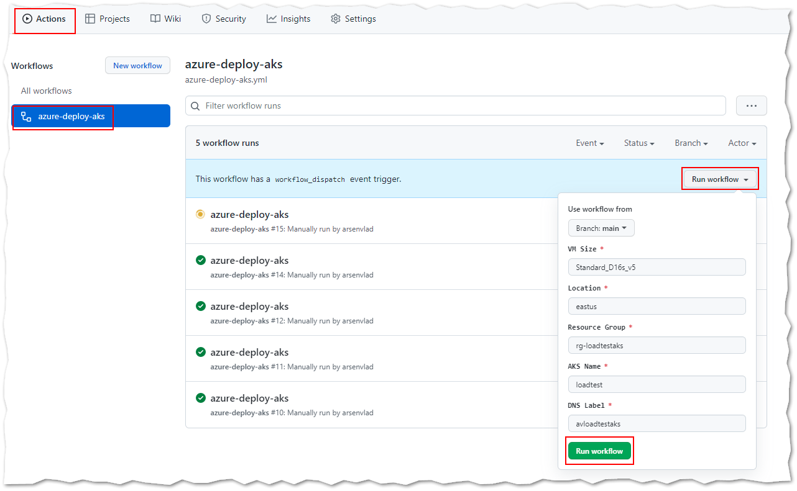

# Azure Load Testing - AKS Example

Simple example of using [Azure Load Testing (preview)](https://docs.microsoft.com/en-us/azure/load-testing/overview-what-is-azure-load-testing) against a simple web app running in AKS.

## Deploy AKS cluster and app using GitHub Action

Run [azure-deploy-aks](../../actions/workflows/azure-deploy-aks.yml) workflow

## Create Azure Load Testing resource

Run [azure-deploy-loadtestservice](../../actions/workflows/azure-deploy-loadtestservice.yml) workflow

> The service principal used by the GitHub Action must have Owner role to be able to assign "Load Test Owner" role to itself.

## Load Test

The GitHub Actions workflow [azure-run-loadtest](../../actions/workflows/azure-run-loadtest.yml) runs the netty_hello_test on schedule every 15 minutes. The workflow can also be invoked manually.

